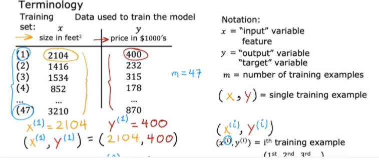
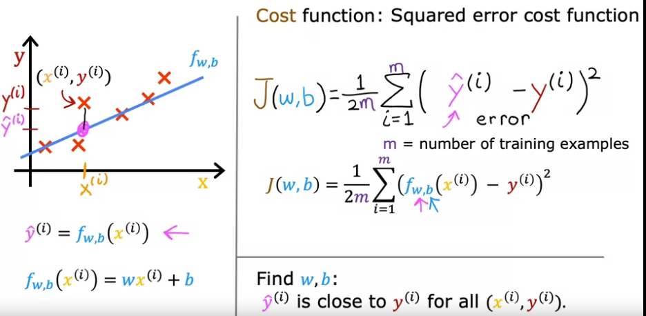
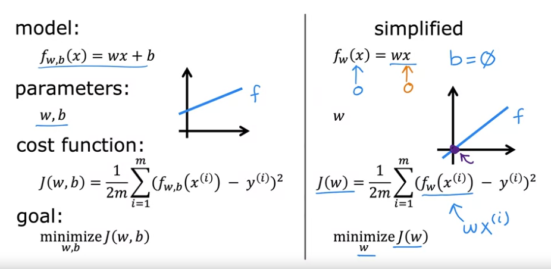
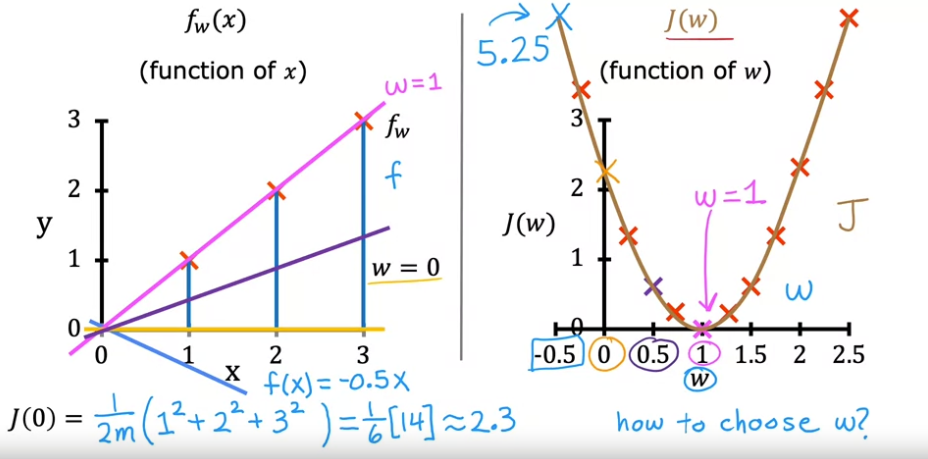

.. _ml_basics:

.. contents::
    :local:
    :depth: 2

Notations, Cost Function, Gradient Descent
===================================================

To explain the concepts in this chapter, we first introduce linear regression.

Linear Regression
------------------

Linear Regression is a supervised machine learning algorithm where the predicted output is continuous. There are types of linear regression: univariate regression and multivariate regression.

The image below, taken from Andrew Ng's ML lectures, shows the notations we are going to use:

Univariate regression
----------------------

Linear regression with one variable (i.e. single feature :math:`x`).
The image below describes the basic concepts in (univariate) linear regression. In this chapter, we only discuss univariate regression to introduce other machine learning concepts in a simplified manner.

.. image:: images/ch1/univariate-linear-regression.png
    :align: center

Cost function
--------------

* Cost function measures the error of the model given the parameters of the model (in this case, the parameters are :math:`w` and :math:`b`).
* The image below shows the squared error cost function.

    * It is taking the errors of all predictions (:math:`m` predictions for :math:`m` training samples)
    * Then squaring each of them individually -- to keep the values positive, summing all the errors
    * Then dividing be the number of training samples :math:`m` to compute the average.
    * By convention and mathematical convenience, the sum of the errors are actually divided by :math:`2m` instead of only :math:`m`

Minimizing the cost function
----------------------------
* The overall goal when we are building an ML model is to minimize the cost function, and hence improve the quality of the predictions by the model.

* So the overall problem is to find :math:`w` for which :math:`J(w)` will be close to the minimum value.
* For the training data shown in the image below (i.e. the values of math:`X` and math:`y`), we plot some values of :math:`J(w)` for some :math:`w` values.

    * As the image shows, when :math:`w=1`, the value of :math:`J(w)` is minimum.

* Now, if we also consider :math:`b`, the plot for :math:`J` becomes a 3D plot.

    * A 3D plot is difficult to interpret.
    * The more interpretable plot with 3 axes is a contour plot. See the image below for an example.
    * Each ovals (or eclipses) in a contour plot has the same :math:`J` value.

.. image:: images/ch1/ch1-contour-plot.png
    :align: center

* How to choose the value of :math:`w` so that `J(w, b)` is close to the minimum value?

