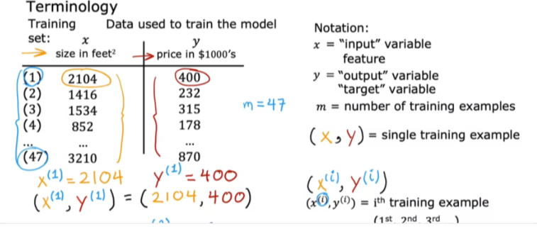

.. _ml_basics:

.. contents::
    :local:
    :depth: 2

Notations, Cost Function, Gradient Descent
===================================================

To explain the concepts in this chapter, we first introduce linear regression.

Linear Regression
------------------

Linear Regression is a supervised machine learning algorithm where the predicted output is continuous. There are 2 types of linear regression: univariate regression and multivariate regression.

The image below, taken from Andrew Ng's ML lectures, shows the notations we are going to use:

Univariate regression
----------------------

Linear regression with one variable (i.e. single feature :math:`x`).
The image below describes the basic concepts in (univariate) linear regression. In this chapter, we only discuss univariate regression to introduce other machine learning concepts in a simplified manner.

.. image:: images/ch1/univariate-linear-regression.png
    :align: center

Cost function
--------------

* Cost function measures the error of the model given the parameters of the model (in this case, the parameters are :math:`w` and :math:`b`).
* The image below shows the squared error cost function.

    * It is taking the errors of all predictions (:math:`m` predictions for :math:`m` training samples)
    * Then squaring each of them individually -- to keep the values positive, summing all the errors
    * Then dividing be the number of training samples :math:`m` to compute the average.
    * By convention and mathematical convenience, the sum of the errors are actually divided by :math:`2m` instead of only :math:`m`

Minimizing the cost function
----------------------------
* The overall goal when we are building an ML model is to minimize the cost function, and hence improve the quality of the predictions by the model.

* So the overall problem is to find :math:`w` for which :math:`J(w)` will be close to the minimum value.
* For the training data shown in the image below (i.e. the values of math:`X` and math:`y`), we plot some values of :math:`J(w)` for some :math:`w` values.

    * As the image shows, when :math:`w=1`, the value of :math:`J(w)` is minimum.

* Now, if we also consider :math:`b`, the plot for :math:`J` becomes a 3D plot.

    * A 3D plot is difficult to interpret.
    * The more interpretable plot with 3 axes is a contour plot. See the image below for an example.
    * Each ovals (or eclipses) in a contour plot has the same :math:`J` value.

.. image:: images/ch1/ch1-contour-plot.png
    :align: center

Cost function implementation
^^^^^^^^^^^^^^^^^^^^^^^^^^^^

The linear regression model that predicts :math:`f_{w,b}(x^{(i)})`:

.. math::
    f_{w,b}(x^{(i)}) = wx^{(i)} + b\tag{1}

In linear regression, we utilize input training data to fit the parameters :math:`w, b` by minimizing a measure of the error between our predictions :math:`f_{w,b}(x^{(i)})` and the actual data :math:`y^{(i)}`. The measure is called the :math:`cost`, :math:`J(w,b)`. In training we measure the cost over all of our training samples :math:`x^{(i)},y^{(i)}`:

.. math::
    J(w,b) = \frac{1}{2m} \sum\limits_{i = 0}^{m-1} (f_{w,b}(x^{(i)}) - y^{(i)})^2\tag{2}

Here we show a simple implementation cost calculation for linear regression:

.. code-block:: python

    import math, copy
    import numpy as np

    # Load our data set
    x_train = np.array([1.0, 2.0])   #features
    y_train = np.array([300.0, 500.0])   #target value

.. code-block:: python

    #Function to calculate the cost
    def compute_cost(x, y, w, b):
    
        m = x.shape[0] 
        cost = 0
        
        for i in range(m):
            f_wb = w * x[i] + b
            cost = cost + (f_wb - y[i])**2
        total_cost = 1 / (2 * m) * cost

        return total_cost

In the :code:`compute_cost` method, we iterate through the input samples, predict :math:`\hat{y}`, calculate the cost for each prediction, accumulae the costs for each predictions by summing the costs, and then divide the summed cost by  :math:`2m`, as defined in equation :math:`(1)`.

* How to choose the values of :math:`w` and :math:`b` so that :math:`J(w, b)` is close to the minimum value? This is what we will discuss in the next section.

Gradient Descent
----------------
Gradient descent is an algorithm to minimze any cost function.

The pseudo code of *gradient descent* is as below:

.. math::

    \begin{align*} \text{repeat}&\text{ until convergence:} \; \lbrace \newline
    \;  w &= w -  \alpha \frac{\partial J(w,b)}{\partial w} \tag{3}  \; \newline 
    b &= b -  \alpha \frac{\partial J(w,b)}{\partial b}  \newline \rbrace
    \end{align*}

where, parameters :math:`w, b` are updated simultaneously.  

The gradient is defined as (i.e. by taking partial derivatives of :math:`J(w, b)` with respect to :math:`w` and :math:`b`):

.. math::
    
    \begin{align}
    \frac{\partial J(w,b)}{\partial w}  &= \frac{1}{m} \sum\limits_{i = 0}^{m-1} (f_{w,b}(x^{(i)}) - y^{(i)})x^{(i)} \tag{4}\\
    \frac{\partial J(w,b)}{\partial b}  &= \frac{1}{m} \sum\limits_{i = 0}^{m-1} (f_{w,b}(x^{(i)}) - y^{(i)}) \tag{5}\\
    \end{align}
    

Here *simultaniously* means that we calculate the partial derivatives for all the parameters before updating any of the parameters.

Why partial derivatives
^^^^^^^^^^^^^^^^^^^^^^^

For the purpose of simplification, let us assume we only have the parameter :math:`w`. The figure below plots a bowl shaped cost function.

The partial derivative w.r.t to a parameter calculates the slope of the cost curve.

A way to think about the derivative at a point in the cost curve is: 

* To draw a tangent line which touches the point
* The slope of this drawn line is the derivative of function j at this point
* We can draw a trigle to get the slope which is computed by dividing the height by the width
 

.. image:: images/ch1/ch1-slopes.png
    :align: center

* On the right side of the plot, the derivative is positive.
* On the left it is negative.
* This means that the after the update, the gradiant descent is taking a step towards the minimum.

Learning rate
^^^^^^^^^^^^^
The choice of the learning rate :math:`\alpha` has a huge impact on the efficiency of gradiant execution.

*  If learning rate is too small, gradiant descent maybe slow.
*  If learning rate is too large, gradiant descent may overshoot and never reach minimum i.e. never converge.

**What happens if gradient descent is already at a local minimum?**

* Gradient descent doesn't update any longer because the slope at the minimum is 0 and which gets multiplied by :math:`\alpha` but nothing gets updated because :math:`\alpha * 0 = 0`.
* This is exactly the desired behaviour becuase once gradient descent reaches a minimum, we do not want it to update any further. 

**Why can gradient descent reach local minimum with a fixed learning rate?**

* As gradient descent gets closer to a local minimum, the derivative gets closer and closer to 0, hence the steps become smaller and smaller.

.. image:: images/ch1/ch1-learning-rate.png
    :align: center

Implement Gradient Descent
--------------------------------
We will implement gradient descent algorithm for one feature. We will need three functions. 

* :code:`compute_gradient` implementing equation (4) and (5) above
* :code:`compute_cost` implementing equation (2) above (we already implemented it above)
* :code:`gradient_descent`, utilizing compute_gradient and compute_cost

compute_gradient
^^^^^^^^^^^^^^^^

`compute_gradient`  implements (4) and (5) above and returns :math:`\frac{\partial J(w,b)}{\partial w}` and :math:`\frac{\partial J(w,b)}{\partial b}`.

.. code-block:: python

    def compute_gradient(x, y, w, b): 
    """
    Computes the gradient for linear regression 
    Args:
      x (ndarray (m,)): Data, m examples 
      y (ndarray (m,)): target values
      w,b (scalar)    : model parameters  
    Returns
      dj_dw (scalar): The gradient of the cost w.r.t. the parameters w
      dj_db (scalar): The gradient of the cost w.r.t. the parameter b     
     """
    
    # Number of training examples
    m = x.shape[0]    
    dj_dw = 0
    dj_db = 0
    
    for i in range(m):  
        f_wb = w * x[i] + b  # equation 1 for x_i 
        dj_dw_i = (f_wb - y[i]) * x[i]  # equation 4 for x_i
        dj_db_i = f_wb - y[i]  # equation 5 for x_i
        dj_db += dj_db_i  # sum for equation 5
        dj_dw += dj_dw_i  # sum for equation 4
    dj_dw = dj_dw / m  # divide by m for equation 5
    dj_db = dj_db / m  # divide by m for equation 4
        
    return dj_dw, dj_db

gradient_descent
^^^^^^^^^^^^^^^^
Now we implement equation (3) below in `gradient_descent`. The details of the implementation are described in the comments. 

.. code-block:: python

    def gradient_descent(x, y, w_in, b_in, alpha, num_iters, cost_function, gradient_function): 
    """
    Performs gradient descent to fit w,b. Updates w,b by taking 
    num_iters gradient steps with learning rate alpha
    
    Args:
      x (ndarray (m,))  : Data, m examples 
      y (ndarray (m,))  : target values
      w_in,b_in (scalar): initial values of model parameters  
      alpha (float):     Learning rate
      num_iters (int):   number of iterations to run gradient descent
      cost_function:     function to call to produce cost
      gradient_function: function to call to produce gradient
      
    Returns:
      w (scalar): Updated value of parameter after running gradient descent
      b (scalar): Updated value of parameter after running gradient descent
      J_history (List): History of cost values
      p_history (list): History of parameters [w,b] 
      """
    
    # An array to store cost J and w's at each iteration primarily for graphing later
    b = b_in
    w = w_in
    
    for i in range(num_iters):
        # Calculate the gradient and update the parameters using gradient_function
        dj_dw, dj_db = gradient_function(x, y, w , b)     

        # Update Parameters using equation (3) above
        b = b - alpha * dj_db                            
        w = w - alpha * dj_dw

        # Save cost J at each iteration
        if i<100000:      # prevent resource exhaustion 
            J_history.append( cost_function(x, y, w , b))
            p_history.append([w,b])
        # Print cost at intervals 10 times or as many iterations if < 10
        if i% math.ceil(num_iters/10) == 0:
            print(f"Iteration {i:4}: Cost {J_history[-1]:0.2e} ",
                  f"dj_dw: {dj_dw: 0.3e}, dj_db: {dj_db: 0.3e}  ",
                  f"w: {w: 0.3e}, b:{b: 0.5e}")

    return w, b  #return w and b; and J, w history for plotting

Now let us call and run gradiant descent for our sample data:

.. code-block:: python

    # initialize parameters
    w_init = 0
    b_init = 0
    # some gradient descent settings
    iterations = 10000
    tmp_alpha = 1.0e-2
    # run gradient descent
    w_final, b_final, J_hist, p_hist = gradient_descent(x_train ,y_train, w_init, b_init, tmp_alpha, 
                                                        iterations, compute_cost, compute_gradient)
    print(f"(w,b) found by gradient descent: ({w_final:8.4f},{b_final:8.4f})")

The output would be as below:

.. code-block:: bash

    Iteration    0: Cost 7.93e+04  dj_dw: -6.500e+02, dj_db: -4.000e+02   w:  6.500e+00, b: 4.00000e+00
    Iteration 1000: Cost 3.41e+00  dj_dw: -3.712e-01, dj_db:  6.007e-01   w:  1.949e+02, b: 1.08228e+02
    Iteration 2000: Cost 7.93e-01  dj_dw: -1.789e-01, dj_db:  2.895e-01   w:  1.975e+02, b: 1.03966e+02
    Iteration 3000: Cost 1.84e-01  dj_dw: -8.625e-02, dj_db:  1.396e-01   w:  1.988e+02, b: 1.01912e+02
    Iteration 4000: Cost 4.28e-02  dj_dw: -4.158e-02, dj_db:  6.727e-02   w:  1.994e+02, b: 1.00922e+02
    Iteration 5000: Cost 9.95e-03  dj_dw: -2.004e-02, dj_db:  3.243e-02   w:  1.997e+02, b: 1.00444e+02
    Iteration 6000: Cost 2.31e-03  dj_dw: -9.660e-03, dj_db:  1.563e-02   w:  1.999e+02, b: 1.00214e+02
    Iteration 7000: Cost 5.37e-04  dj_dw: -4.657e-03, dj_db:  7.535e-03   w:  1.999e+02, b: 1.00103e+02
    Iteration 8000: Cost 1.25e-04  dj_dw: -2.245e-03, dj_db:  3.632e-03   w:  2.000e+02, b: 1.00050e+02
    Iteration 9000: Cost 2.90e-05  dj_dw: -1.082e-03, dj_db:  1.751e-03   w:  2.000e+02, b: 1.00024e+02
    (w,b) found by gradient descent: (199.9929,100.0116)

* The cost starts large and rapidly declines.
* The partial derivatives, `dj_dw`, and `dj_db` also get smaller, rapidly at first and then more slowly.
* Progress slows though the learning rate, alpha, remains fixed.

Predictions
-----------
We can use the optimal values of parameters :math:`w`  and  :math:`b` to predict housing values based on the learned parameters. As expected, the predicted values are nearly the same as the training values for the same housing. Aditionally, the value not in the training values is in line with the expected value.

.. code-block:: python

    print(f"1000 sqft house prediction {w_final*1.0 + b_final:0.1f} Thousand dollars")
    print(f"1200 sqft house prediction {w_final*1.2 + b_final:0.1f} Thousand dollars")
    print(f"2000 sqft house prediction {w_final*2.0 + b_final:0.1f} Thousand dollars")

.. code-block:: bash

    1000 sqft house prediction 300.0 Thousand dollars
    1200 sqft house prediction 340.0 Thousand dollars
    2000 sqft house prediction 500.0 Thousand dollars
