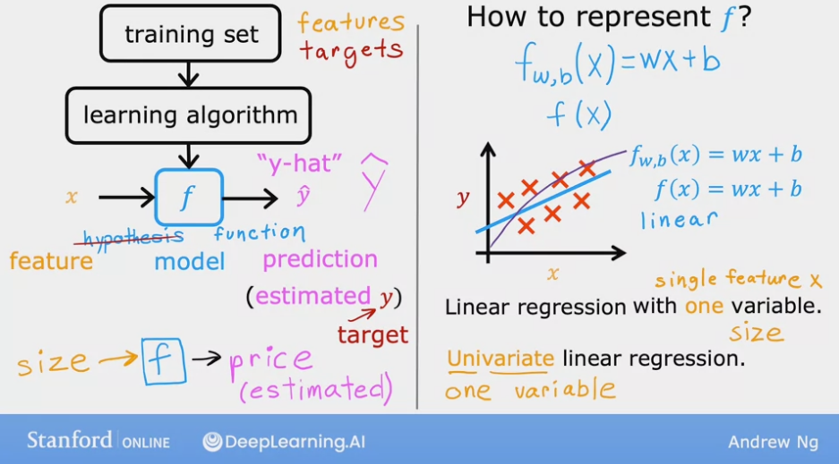

.. _ml_basics:

.. contents::
    :local:
    :depth: 2

Notations, Cost Function, Gradient Descent
===================================================

To explain the concepts in this chapter, we first introduce linear regression.

Linear Regression
------------------

Linear Regression is a supervised machine learning algorithm where the predicted output is continuous. There are 2 types of linear regression: univariate regression and multivariate regression.

The image below, taken from Andrew Ng's ML lectures, shows the notations we are going to use:

.. image:: images/ch1/ch1-notations.png
    :align: center

Univariate regression
----------------------

Linear regression with one variable (i.e. single feature :math:`x`).
The image below describes the basic concepts in (univariate) linear regression. In this chapter, we only discuss univariate regression to introduce other machine learning concepts in a simplified manner.

Cost function
--------------

* Cost function measures the error of the model given the parameters of the model (in this case, the parameters are :math:`w` and :math:`b`).
* The image below shows the squared error cost function.

    * It is taking the errors of all predictions (:math:`m` predictions for :math:`m` training samples)
    * Then squaring each of them individually -- to keep the values positive, summing all the errors
    * Then dividing be the number of training samples :math:`m` to compute the average.
    * By convention and mathematical convenience, the sum of the errors are actually divided by :math:`2m` instead of only :math:`m`

.. image:: images/ch1/ch1-cost-function-MSE.png
    :align: center

Minimizing the cost function
----------------------------
* The overall goal when we are building an ML model is to minimize the cost function, and hence improve the quality of the predictions by the model.

.. image:: images/ch1/ch1-minimize-cost.png
    :align: center

* So the overall problem is to find :math:`w` for which :math:`J(w)` will be close to the minimum value.
* For the training data shown in the image below (i.e. the values of math:`X` and math:`y`), we plot some values of :math:`J(w)` for some :math:`w` values.

    * As the image shows, when :math:`w=1`, the value of :math:`J(w)` is minimum.

.. image:: images/ch1/ch1-cost-plot.png
    :align: center

* Now, if we also consider :math:`b`, the plot for :math:`J` becomes a 3D plot.

    * A 3D plot is difficult to interpret.
    * The more interpretable plot with 3 axes is a contour plot. See the image below for an example.
    * Each ovals (or eclipses) in a contour plot has the same :math:`J` value.

Cost function implementation
^^^^^^^^^^^^^^^^^^^^^^^^^^^^

The linear regression model that predicts :math:`f_{w,b}(x^{(i)})`:

.. math::
    f_{w,b}(x^{(i)}) = wx^{(i)} + b\tag{1}

In linear regression, we utilize input training data to fit the parameters :math:`w, b` by minimizing a measure of the error between our predictions :math:`f_{w,b}(x^{(i)})` and the actual data :math:`y^{(i)}`. The measure is called the :math:`cost`, :math:`J(w,b)`. In training we measure the cost over all of our training samples :math:`x^{(i)},y^{(i)}`:

.. math::
    J(w,b) = \frac{1}{2m} \sum\limits_{i = 0}^{m-1} (f_{w,b}(x^{(i)}) - y^{(i)})^2\tag{2}

Here we show a simple implementation cost calculation for linear regression:

.. code-block:: python

    import math, copy
    import numpy as np

    # Load our data set
    x_train = np.array([1.0, 2.0])   #features
    y_train = np.array([300.0, 500.0])   #target value

.. code-block:: python

    #Function to calculate the cost
    def compute_cost(x, y, w, b):
    
        m = x.shape[0] 
        cost = 0
        
        for i in range(m):
            f_wb = w * x[i] + b
            cost = cost + (f_wb - y[i])**2
        total_cost = 1 / (2 * m) * cost

        return total_cost

In the :code:`compute_cost` method, we iterate through the input samples, predict :math:`\hat{y}`, calculate the cost for each prediction, accumulae the costs for each predictions by summing the costs, and then divide the summed cost by  :math:`2m`, as defined in equation :math:`(1)`.

* How to choose the values of :math:`w` and :math:`b` so that :math:`J(w, b)` is close to the minimum value? This is what we will discuss in the next section.

Gradient Descent
----------------
Gradient descent is an algorithm to minimze any cost function.

The pseudo code of *gradient descent* is as below:

.. math::

    \begin{align*} \text{repeat}&\text{ until convergence:} \; \lbrace \newline
    \;  w &= w -  \alpha \frac{\partial J(w,b)}{\partial w} \tag{3}  \; \newline 
    b &= b -  \alpha \frac{\partial J(w,b)}{\partial b}  \newline \rbrace
    \end{align*}

where, parameters :math:`w, b` are updated simultaneously.  

The gradient is defined as (i.e. by taking partial derivatives of :math:`J(w, b)` with respect to :math:`w` and :math:`b`):

.. math::
    
    \begin{align}
    \frac{\partial J(w,b)}{\partial w}  &= \frac{1}{m} \sum\limits_{i = 0}^{m-1} (f_{w,b}(x^{(i)}) - y^{(i)})x^{(i)} \tag{4}\\
    \frac{\partial J(w,b)}{\partial b}  &= \frac{1}{m} \sum\limits_{i = 0}^{m-1} (f_{w,b}(x^{(i)}) - y^{(i)}) \tag{5}\\
    \end{align}
    

Here *simultaniously* means that we calculate the partial derivatives for all the parameters before updating any of the parameters.

Implement Gradient Descent
--------------------------------
We will implement gradient descent algorithm for one feature. We will need three functions. 

* :code:`compute_gradient` implementing equation (4) and (5) above
* :code:`compute_cost` implementing equation (2) above (we already implemented it above)
* :code:`gradient_descent`, utilizing compute_gradient and compute_cost

compute_gradient
^^^^^^^^^^^^^^^^

`compute_gradient`  implements (4) and (5) above and returns :math:`\frac{\partial J(w,b)}{\partial w}` and :math:`\frac{\partial J(w,b)}{\partial b}`.

.. code-block:: python

    def compute_gradient(x, y, w, b): 
    """
    Computes the gradient for linear regression 
    Args:
      x (ndarray (m,)): Data, m examples 
      y (ndarray (m,)): target values
      w,b (scalar)    : model parameters  
    Returns
      dj_dw (scalar): The gradient of the cost w.r.t. the parameters w
      dj_db (scalar): The gradient of the cost w.r.t. the parameter b     
     """
    
    # Number of training examples
    m = x.shape[0]    
    dj_dw = 0
    dj_db = 0
    
    for i in range(m):  
        f_wb = w * x[i] + b  # equation 1 for x_i 
        dj_dw_i = (f_wb - y[i]) * x[i]  # equation 4 for x_i
        dj_db_i = f_wb - y[i]  # equation 5 for x_i
        dj_db += dj_db_i  # sum for equation 5
        dj_dw += dj_dw_i  # sum for equation 4
    dj_dw = dj_dw / m  # divide by m for equation 5
    dj_db = dj_db / m  # divide by m for equation 4
        
    return dj_dw, dj_db

gradient_descent
^^^^^^^^^^^^^^^^
Now we implement equation (3) below in `gradient_descent`. The details of the implementation are described in the comments. 

.. code-block:: python

    def gradient_descent(x, y, w_in, b_in, alpha, num_iters, cost_function, gradient_function): 
    """
    Performs gradient descent to fit w,b. Updates w,b by taking 
    num_iters gradient steps with learning rate alpha
    
    Args:
      x (ndarray (m,))  : Data, m examples 
      y (ndarray (m,))  : target values
      w_in,b_in (scalar): initial values of model parameters  
      alpha (float):     Learning rate
      num_iters (int):   number of iterations to run gradient descent
      cost_function:     function to call to produce cost
      gradient_function: function to call to produce gradient
      
    Returns:
      w (scalar): Updated value of parameter after running gradient descent
      b (scalar): Updated value of parameter after running gradient descent
      """
    
    # An array to store cost J and w's at each iteration primarily for graphing later
    b = b_in
    w = w_in
    
    for i in range(num_iters):
        # Calculate the gradient and update the parameters using gradient_function
        dj_dw, dj_db = gradient_function(x, y, w , b)     

        # Update Parameters using equation (3) above
        b = b - alpha * dj_db                            
        w = w - alpha * dj_dw                            

    return w, b  #return w and b